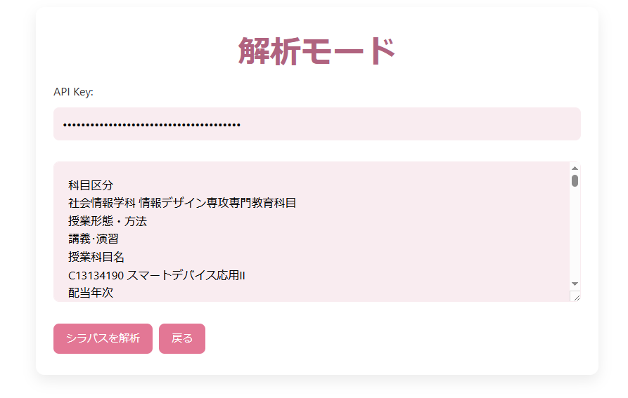
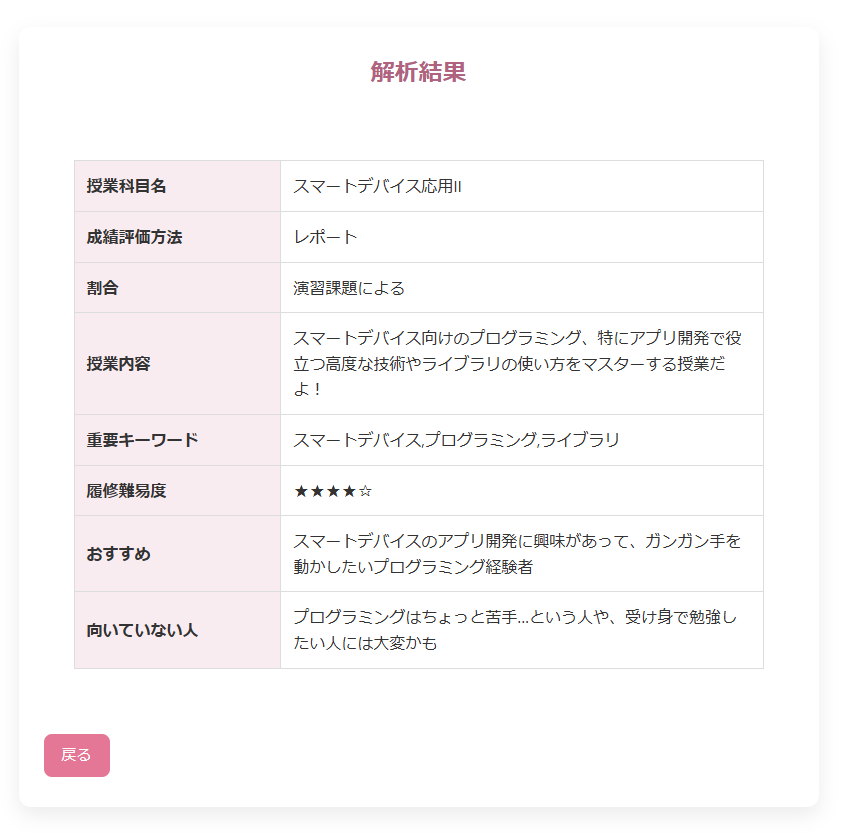
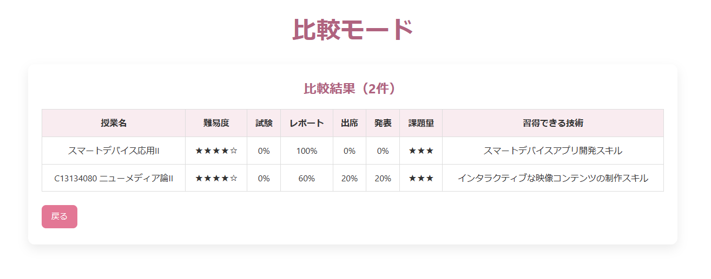

# シラバス解析・比較アプリ
アプリURL　https://mikicj0107.github.io/Shirabasu/

## 概要
履修登録時に複数のシラバスを比較する負担を減らすために
制作したWebアプリです。
大学２年生後期の授業にて制作しました。

## 主な機能
・シラバスの解析
・解析結果の項目別表示
・複数授業の比較

## 使用技術
HTML / CSS / JavaScript / Gemini API

## 画面

### ① シラバス入力画面

### ② AIによる解析結果

### ③ 授業比較画面

## 工夫した点
Gemini APIから返されたJSONデータをJavaScriptで処理し、
画面に表示できるようにしました。

また、複数の授業を比較できるように、解析したデータをlocalStorageに一時保存し、授業名・難易度・評価方法・課題量などを一覧で比較できるようにしました。
